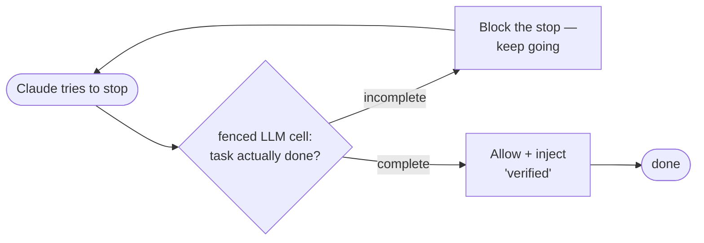

# stull

**The easy way to build Claude Code hook meshes that an agent won't fumble.** You
wire LLM judgment and deterministic code checks into a little state machine; stull
compiles it to the `settings.json` hooks that run it — and won't compile one
that's unsafe (injects on a trigger that can't, loops forever, or branches on the
model's raw output).

Take the loop everyone ends up hand-rolling — *after Claude stops, make it prove
the task is actually done, and push it to keep going if not:*



By hand that's a `Stop`-hook script plus a state file you babysit. As a stull
machine it's a declaration you can watch run on scripted answers before spending a
token — it blocks until the cell says *done*, and a **fuel** budget caps the
retries so the loop is guaranteed to end:

```
scenario "converges"
  trigger      from     to       fuel  kind    detail
  Stop         loop     loop     4->3  block   exit2: Task not yet complete — continue with the next concrete step.
  Stop         loop     loop     3->2  block   exit2: Task not yet complete — continue with the next concrete step.
  Stop         loop     done     2->1  inject  ctx: Verified: the task is complete.
  -> final state "done", fuel 1
```

The whole machine is one LLM **cell** that judges done / not-done — its answer
can't reach your code until it's been checked — and two **guards** that let the
stop through or block it. It's about fifteen lines of Go; the source is
[below](#defining-a-machine).

```
go install ./cmd/stull      # put `stull` on $PATH (once; or `make install`)
stull sim     review-loop    # play the whole loop out on scripted answers — no tokens spent
stull compile review-loop    # emit the settings.json hooks
```

Adding a step is one more transition, not another hand-wired script — and `check`
proves the machine sound before you ship it. (Full source: `examples/reviewloop`,
run as
`stull sim review-loop`; a pure-code guard with no LLM — "block `git add -A`
every time" — is `examples/denyguard`, run as `stull sim deny-add-all`.)

### Swap the judgment without touching the wiring

`examples/hedgeverify` rebuilds a real shipped hook
([`likely`](https://github.com/terpjwu1/likely) — catch Claude hedging, nudge it
to verify next turn) as a *single* machine. The cheap version spots a hedge with
a regexp; the smart version swaps in an LLM cell that tells a load-bearing hedge
from genuine uncertainty. **The only line that changes is the lens:**

```go
build("hedge-verify",       spec.TranscriptMatches(hedge))                 // regexp lens — zero model calls
build("hedge-verify-smart", spec.TermIs("assess", "load-bearing"), assess) // LLM lens — same substrate, gate, action
```

Same memory (`SetVar` into the machine's vars), same session scoping, same
two-trigger hook emission — all of which `likely` hand-rolls across two scripts, a
signal file with atomic writes and a TTL, and two installers. Snap the cheap one
together in minutes; upgrade the judgment in place when it earns it.

This is a working, self-contained Go module; the remaining edges (a real bus
behind `Emit`, an analyzer over the calibration log, cross-host state) are in
*What's stubbed*.

## Beyond hooks: fence any LLM call

A `Cell` is useful on its own — you don't need a machine to get the fence. Build a
`NewConfinedCell`, drive the model yourself, and hand the completion to
`Cell.Check`; trust only a `WellFormed && Safe` term. The schema confines
generation to a vetted set; `Grammar` + `Safety` are the parse-time backstop, so
an answer outside that set is `WellFormed`-but-not-`Safe` and fails safe instead
of acting on something the model invented.

> basanite uses `spec.Cell` standalone as a fenced-oracle library — a
> deterministic frequency detector manufactures a vetted candidate ladder, the
> Cell fences an LLM to *select* from it (never invent), and `Cell.Check`'s
> grammar + safety make a malformed or incoherent verdict fail safe to a
> deterministic default.

The whole pattern is the runnable `ExampleCell_standaloneFence` in `spec` (~20
lines). So stull is two things: a hook state-machine framework, **and** a
standalone primitive to fence *any* LLM call to a formal language + safety check.

## How it maps to hybrid loops

If you've seen **[hybrid loops](https://github.com/justinstimatze/hybrid)** — LLM
judgment and deterministic code in alternating layers, each feeding the other's
working surface (lens → gate → reasoner → action) — that's exactly the shape
above. A **cell** is the lens/reasoner, *fenced* so its
answer lands in a small language you define before any code trusts it; a
**guard** is the gate, a deterministic decision; an **effect** is the action
(`Block` a tool call, `Inject` context, `Run` a cell, `Emit` to another machine);
and **fuel** keeps the loop honest — it always halts. stull is how you wire one
together as real Claude Code hooks: it generates the `settings.json`, manages the
per-session state, runs one generic dispatcher, and (nice, but not the point)
won't compile a broken one. Self-contained Go module, stdlib only, with the model
call live-bound to the Anthropic Messages API.

## Glossary

stull leans on a few load-bearing terms. Plain-language here; the formal version
is in [docs/DESIGN.md](docs/DESIGN.md):

- **machine** — a state machine: states, plus transitions between them that fire
  on a hook event.
- **trigger** — the hook event a transition fires on (`PreToolUse`, `Stop`, …).
- **guard** — a deterministic, no-LLM condition on a transition; it fires only if
  the guard holds.
- **cell** — a *fenced* LLM call. Its output must parse into a formal language you
  define (its **grammar**) and pass a **safety** check before any guard may read
  it — so a model answer can never gate the machine unchecked. (A pure-code guard
  has no cell at all — see `examples/denyguard`.)
- **effect** — what a fired transition does: `Block` (refuse the action; on a
  `Stop` that's the "keep going" primitive), `Inject` (add context), `SetVar`
  (write to the machine's cross-turn memory — how it accumulates a structure over
  a session), `Run` (run a cell), `Emit` (message another machine).
- **fuel** — a step budget: every fired transition spends one, and at zero the
  machine stops gating. It's what guarantees the machine always halts. For a
  standing guard it's effectively a *denial* budget — a safe event fires nothing,
  so it costs nothing.
- **total** — always-terminating. stull guarantees it via the fuel bound.
- **`E-…` / `W-…`** — checker codes: `E-` is a hard error (won't compile), `W-` a
  warning (compiles, but loudly).

## Why this shape

Snapping the loop together is the pitch; this section is the safety net under it
— why a mesh you wired up in minutes can't be an unsafe one. (Skip it if you just
want to ship; come back when you want to know what the checker is buying you.)

A hook mesh is trivially Turing complete (arbitrary programs as nodes + a `Stop`
hook that refuses to halt = an unbounded loop). But Turing-completeness brings
the halting problem, so an LLM-in-the-loop mesh that is TC **cannot** be formally
guaranteed to behave. `stull` deliberately targets the class one rung below: a
**total** (always-terminating) guarded statechart, where

- the **control-flow skeleton is deterministic and analyzable**, and
- the **LLM is a fenced oracle** whose output can never move the machine into an
  unverified state.

A `Cell` is a **formal oracle** (Russell's sense): an LLM whose output is
confined to a formal language and checked for safe actions before it can
influence anything. Its contract is two decidable stages, both mandatory:

- **Grammar** — formal-language membership: parse raw output into a well-formed
  term, or reject it as outside the language `L`.
- **Safety** — over a well-formed term, decide whether the action it denotes is
  safe.

A term reaches control flow only if it is `WellFormed && Safe`; otherwise the
machine takes its fail-safe path. (Generation-time confinement — constrained
decoding so the model *can only* emit `L` — is the runtime's job; the Grammar is
the parse-time backstop. See *What's stubbed*.)

The load-bearing invariant: *an LLM output may never gate a transition without a
deterministic check between it and the transition.* `stull` makes the unsafe
shapes **inexpressible**:

| Unsafe shape | How it is made impossible |
|---|---|
| An oracle that emits unconstrained or unchecked output | `spec.NewCell` requires both a grammar and a safety check; the fields are unexported, so a `Cell` literal without them won't compile elsewhere |
| A guard branching on raw oracle output | `check` rejects any guard reading `cells.X.raw` (only `.term`/`.wellformed`/`.safe`) — code `E-ORACLE` |
| Injecting on a trigger that can't inject | `E-INJECT` (e.g. `Inject` on `PreToolUse`) |
| Blocking on a trigger that can't block | `E-BLOCK` (e.g. `Block` on `PostToolUse`) |
| A loop that can never end | a mandatory positive `Fuel` bound (`E-FUEL`) makes every machine total — once fuel hits 0 it stops gating. A machine with no reachable terminal is *not* rejected (a standing guard wants exactly that); it compiles with a loud `W-HALT` warning, since fuel already guarantees it stops |
| A hook crash bricking the session | `runtime.SafeDispatch` recovers and fails open (exit 0, no output) |

## Mapping to prior art

`stull` is the type system over primitives that already exist separately:

| Layer | Prior art it abstracts |
|---|---|
| typed guard/effect split | Claude Code's own hook model (`Pre*`=decision, `Post*`=fire-and-forget), Windsurf Cascade |
| the bus / inbox transport (`Emit`) | mcp-dispatch (piggyback delivery + Stop-hook fallback) |
| the read-once legitimacy `Contract` | slimemold (behavioral contract vs data-only injection) |
| fail-open dispatcher, calibration tap | hindcast (`Guard`, bounded logging) |
| the `Stop`-loop clock + `Fuel` bound | Ralph Wiggum loop, made total |
| whole-mesh observation | disler multi-agent-observability (star tap) |

## Layout

```
spec/      the statechart language (pure data + deterministic predicates)
check/     the static checker — makes unsafe meshes inexpressible
runtime/   the generic hook dispatcher (fail-open, total)
compile/   machine -> settings.json hooks fragment
sim/       deterministic simulator (scripted oracle, no model call)
registry/  name -> machine, for the CLI
examples/  reviewloop:  a worked Stop-loop, oracle-gated      (stull sim review-loop)
           denyguard:   a standing guard, oracle-free         (stull sim deny-add-all)
           hedgeverify: the bridge — accumulate across turns, swap a regexp lens
             for an LLM lens on the SAME wiring; rebuilds `likely`
             (stull sim hedge-verify  /  hedge-verify-smart)
cmd/stull/ the CLI
```

## Use

```bash
go install ./cmd/stull                     # put `stull` on $PATH (or: make install)

stull check   review-loop                  # static soundness report
stull explain review-loop --json           # the machine's shape + soundness, machine-readable
stull compile review-loop /path/to/stull   # settings.json hooks fragment (prints only)
stull install review-loop                  # merge those hooks into settings.json (--write to apply)
stull sim     review-loop                  # run the demo scenarios
STULL_TRACE=1 stull run --machine review-loop   # hook dispatcher; trace each step to stderr
```

(No install? Every command works as `go run ./cmd/stull <args>` from the repo.)

`explain` is the introspection an agent reads instead of the Go source — every
trigger, what each transition reads and does, the cells, and whether it is sound
— as text or `--json`. `install` closes the "now where does the fragment go?"
gap: it merges a machine's hooks into `~/.claude/settings.json` (`--project` for
`./.claude/settings.json`), idempotently, dry-run by default and backing the file
up before it writes. And `STULL_TRACE=1` makes a live `stull run` narrate each
step to stderr — so a hand-run hook isn't a silent black box. None of these touch
the hook protocol on stdout or change an exit code; the live path stays fail-open.

`stull sim review-loop` shows the worked example converging, failing safe on
invalid oracle output, and staying total under a stuck oracle:

```
scenario "converges"
  trigger   from   to     fuel  kind    detail
  Stop      loop   loop   4->3  block   exit2: Task not yet complete — continue ...
  Stop      loop   loop   3->2  block   exit2: Task not yet complete — continue ...
  Stop      loop   done   2->1  inject  ctx: Verified: the task is complete.
```

## Use it in your own project

stull is a library — you don't fork this repo to add machines. Build a small
binary that imports stull, defines your machine, and calls the same fail-open
hook path the bundled CLI runs:

```go
package main

import (
    "os"

    "github.com/justinstimatze/stull/runtime"
    "yourmod/machines/denyguard"
)

func main() {
    // RunHook is the whole live path: read the event on stdin, advance the
    // machine, persist, deliver Emits, write the hook protocol — fail-open.
    os.Exit(runtime.RunHook(denyguard.Machine(), runtime.AnthropicModel))
}
```

Point a `settings.json` hook command at that binary — `stull install <machine>`
will merge it in for you (idempotent, backs up first), or generate the fragment
with `compile.SettingsJSON(machine, "your-binary")` and merge it yourself with
`compile.MergeHooks`. The authoring side is plain
library calls on an in-memory `spec.Machine`: `check.Inspect(m)` to prove it,
`compile.SettingsJSON(m, …)` to emit hooks — the whole *discover → build → check
→ compile → run* path, no fork. See *Public surface & stability* for what's safe
to depend on.

## Defining a machine

```go
assess := spec.NewCell("assess", "claude-sonnet-4-6",
    "Output exactly 'complete' or 'incomplete'.",
    func(raw string) (string, bool) {        // Grammar: membership in L
        v := strings.ToLower(strings.TrimSpace(raw))
        return v, v == "complete" || v == "incomplete"
    },
    func(string) bool { return true })       // Safety: a classification is safe

loop := spec.State{Name: "loop", On: []spec.Transition{
    {On: spec.Stop, To: "done",
        Guard: &spec.Guard{Reads: []string{"cells.assess.term"},   // formal output only
            When: func(c *spec.Context) bool { return c.Cell("assess").WellFormed && c.Cell("assess").Term == "complete" }},
        Do: []spec.Effect{spec.Inject{Text: spec.S("Verified complete.")}}},
    {On: spec.Stop, To: "loop",
        Guard: &spec.Guard{Reads: []string{"cells.assess.term"},
            When: func(c *spec.Context) bool { return c.Cell("assess").WellFormed && c.Cell("assess").Term == "incomplete" }},
        Do: []spec.Effect{spec.Block{Reason: spec.S("Not done — continue.")}}},
}}

m := spec.Machine{Name: "review-loop", Fuel: 4, Initial: "loop",
    Contract: "You installed review-loop ...",
    States: []spec.State{loop, {Name: "done", Terminal: true}},
    Cells:  []spec.Cell{assess}}
```

Register it in `registry`, then `check` / `compile` / `sim` / `run` it.

(The two guards above are spelled out longhand to show the shape; in practice
write `spec.TermIs("assess", "complete")`, which declares `Reads` for you.)

### Execution semantics worth knowing

Four contracts the runtime guarantees — none can bite you silently (the checker
or `sim` catches the misuse), but knowing them up front saves a round-trip:

- **Transitions fire in declaration order.** Per event the first transition whose
  trigger matches and whose guard holds (or is nil) wins; the rest are skipped.
  Order specific-first, catch-all last — an earlier unconditional transition
  shadows later ones on the same trigger (`check` flags it: **W-SHADOW**).
- **Guards are pure.** A `When` reads the context and returns a bool — it must not
  write `Vars` or any state (use a `SetVar` effect). A guard that mutates `Vars`
  is caught and surfaced as a `sim` lint; a panicking guard fails open to a no-op.
- **`SetVar` is cross-event.** A write lands in `Vars` for the *next* event, not
  the current one — each event fires one transition, whose effects run after its
  guard already evaluated. Accumulation is always read-old-then-write-new.
- **A guard can only read *validated* cell output** (`.Term`/`.WellFormed`/
  `.Safe`) — the raw completion isn't retained, so it won't compile, and `check`
  rejects a `cells.X.raw` declaration. Reading a cell you forgot to declare in
  `Reads` is a `sim` lint (the cell never runs, so the guard is silently false).

## What's stubbed

- **The model call and generation-time confinement are bound** (and live-verified
  against the real Messages API). `runtime.AnthropicModel` uses only the standard
  library and is fail-safe on every error (no key / network / non-200 / refusal →
  `""`, so cells fall outside `L` and the machine takes its fail-safe path). The
  cell's instruction is the **system** block (frozen, with a `cache_control`
  breakpoint that activates once a system prompt exceeds the model's minimum
  cacheable size); the hook context the cell declares via `Reading(...)` —
  `NeedTranscript` (read from `transcript_path`, tail-bounded), `NeedEvent`,
  `NeedPrompt` — is the **user** turn. A `spec.NewConfinedCell(..., schema, ...)`
  is confined at generation time: a forced strict tool call over `schema`, so the
  model *can only* emit a value in `L`, with `Grammar` as the parse-time backstop.
  Honest remaining edges: unconfined cells (`NewCell`) rely on `Grammar` alone;
  `strict` schemas are limited to the supported subset (objects +
  `additionalProperties:false`; no min/max, recursion); the transcript is
  tail-bounded for recency, which forgoes prefix caching of the transcript; and
  thinking is off (fine for a hot-path classifier, could be per-cell later).
- **`Emit` writes a local inbox, not a live bus.** `runtime.WriteInbox` delivers
  each emitted message as an atomic JSON file under `{dir}/{target}/`
  (`cmd/stull run` uses `$STULL_INBOX_DIR` or `~/.cache/stull/inbox`, fail-open,
  target collapsed to one path segment so it can't escape). This is a
  stull-defined local artifact — forwarding it onto a real bus (mcp-dispatch) is
  a separate adapter, deliberately not built until that on-disk contract is
  verified.
- **The calibration tap is a substrate, not a closed loop.** `runtime.Calibrate`
  (off by default; `cmd/stull run` installs `FileCalibrator`, fail-open, local
  JSONL) records two joinable halves per session+machine: the per-cell
  *prediction* (`term`/`wellformed`/`safe`) and the per-step *outcome* (the
  machine's own block/inject/fuel-halt behavior — a **proxy** verdict, not
  correctness). It makes the calibration join *possible*; it deliberately does
  not close back onto the oracle (stull contains the stochastic part, it doesn't
  steer it), and the correctness verdict still needs an external join.

## Properties the checker buys you

Because the skeleton is deterministic, these are decidable on the spec, before a
single turn runs: **reachability**, **termination** (the mandatory `Fuel` bound —
the one hard floor), and the safety property *no transition is gated on
unvalidated oracle output*. A **reachable terminal** is checked too, but as a
loud `W-HALT` *warning*, not a hard error: fuel already guarantees the machine
stops, and a standing guard legitimately has no natural terminal — stull's job is
to make sure that shape can't pass *silently*, not to forbid it. What is **not**
guaranteed — and cannot be — is the correctness of an individual cell's output.
That is the irreducible stochastic part; stull's job is to contain it, not
eliminate it.

## Public surface & stability

If you import stull as a library to emit and prove your own machines, this is
the authoring contract — the surface meant to be depended on:

- **`spec`** — the language. Build machines with `spec.Machine` and its parts
  (`State`, `Transition`, `Guard`, the `Effect` types `Inject`/`Block`/`Run`/
  `Emit`, `Trigger` constants); fenced oracles with `NewCell` /
  `NewConfinedCell` (`.Reading(...)` for hook context); oracle-free guards with
  the event helpers `ToolIs` / `CommandMatches` / `And`. `Injecting` / `Gating`
  report a trigger's capabilities.
- **`check`** — the proof. `Check(m) []string` (hard errors only, empty == it
  compiles), `Validate(m) error` (same, as one error), `Inspect(m) Report`
  (errors *and* warnings, with `Report.Sound()`). The `E-…` / `W-…` codes are
  stable identifiers you can match on.
- **`compile`** — `SettingsFragment(m, binary)` / `SettingsJSON(m, binary)`,
  both over an in-memory `spec.Machine` (no registry needed). They validate
  first, so they only emit a fragment for a machine with no hard errors.

The full `discover → build → Inspect → compile` path runs in one process against
these three packages. `runtime` is the execution seam (`SafeDispatch`,
`AnthropicModel`, the calibration/inbox sinks) — depend on it only if you embed
the dispatcher rather than shell out to `stull run`; treat its internals as less
stable than the authoring surface above.

**Stability:** stull is **pre-1.0 and untagged** — pin to a commit. The authoring
surface above is the intended-stable contract and changes here will be
deliberate and called out; everything else (runtime internals, the calibration
record shape — versioned by `runtime.SchemaVersion`, the local inbox layout) may
move without ceremony until a tagged 1.0.

## Design notes

See [docs/DESIGN.md](docs/DESIGN.md) for the formal-oracle model, the
total-statechart-vs-Turing-completeness argument, and the Russell /
reflective-oracle readings.
